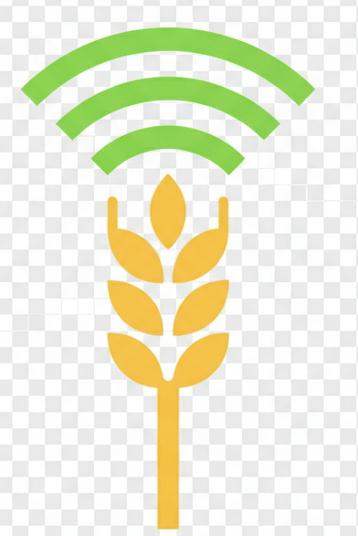

# 🌾 AgriSense

## 📘 Visão Geral

O **AgriSense** é uma plataforma de **gestão e monitoramento de dados IoT** voltada ao setor agrícola.  
Ela permite **coletar, armazenar e visualizar em tempo real** informações provenientes de sensores de **temperatura** e **umidade do solo**, auxiliando na tomada de decisão sobre irrigação e produtividade.

Com base em uma arquitetura moderna utilizando **Kubernetes**, **FastAPI**, **React**, **PostgreSQL** e **Grafana**, o sistema oferece escalabilidade, resiliência e automação por meio de pipelines **CI/CD** no **GitLab**.

---

## 🧩 Tecnologias Utilizadas

| Camada | Tecnologia | Descrição |
|--------|-------------|-----------|
| **Backend** | [FastAPI](https://fastapi.tiangolo.com/) | API de ingestão e processamento dos dados IoT |
| **Frontend** | [React.js](https://react.dev/) | Dashboard interativo para visualização dos dados |
| **Banco de Dados** | [PostgreSQL](https://www.postgresql.org/) | Armazenamento estruturado dos dados dos sensores |
| **Orquestração** | [Kubernetes](https://kubernetes.io/) | Gerenciamento de containers e escalabilidade |
| **CI/CD** | [GitLab CI](https://about.gitlab.com/stages-devops-lifecycle/continuous-integration/) | Automação de builds, testes e deploys |
| **Monitoramento** | [Prometheus](https://prometheus.io/) e [Grafana](https://grafana.com/) | Coleta e visualização de métricas do sistema |
| **Containerização** | [Docker](https://www.docker.com/) | Empacotamento e execução dos serviços |

---

## 📁 Estrutura do Projeto