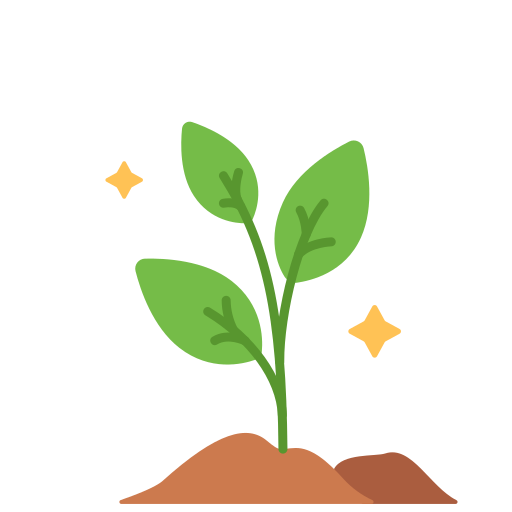

# 🌾 AgriNexus

 

## 📘 Visão Geral

O **AgriNexus** é uma plataforma completa de **agricultura de precisão e gestão IoT** desenvolvida como projeto de TCC.  
A plataforma integra hardware (sensores IoT como LILYGO T-Higrow) e software para **coletar, armazenar e analisar em tempo real** métricas climáticas e de solo (umidade, temperatura, luz, tensão de bateria), auxiliando os agricultores na tomada de decisão.

Além do monitoramento em tempo real, o sistema conta com recursos de **Inteligência Artificial (Google Gemini)** para análises preditivas, um **Chatbot Agrônomo** interativo, proteção avançada por **Tokens JWT** (OAuth2), e módulos de **Gestão Financeira** e de **Agendamentos**.

---

## 🧩 Tecnologias Utilizadas

| Categoria | Tecnologia | Descrição |
|-----------|-------------|-----------|
| **Frontend** | [React.js](https://react.dev/) + Vite | Interface Single Page Application (SPA), estilização com CSS puro e gráficos com Recharts. |
| **Backend** | [FastAPI](https://fastapi.tiangolo.com/) (Python) | API REST escalável e de alta performance, responsável por gerenciar a lógica de negócios. |
| **Banco de Dados** | [PostgreSQL](https://www.postgresql.org/) | Armazenamento relacional estruturado utilizando o ORM **SQLAlchemy**. |
| **Inteligência Artificial** | Google Gemini (2.5-flash) | Processamento de linguagem natural para geração de insights em tempo real e Chatbot. |
| **Segurança** | JWT & bcrypt | Fluxo de autenticação OAuth2 com emissão de Tokens e criptografia avançada de senhas. |
| **Hardware IoT** | C++ / ESP32 | Sensores de umidade de solo e ambiente que se comunicam com a API via requisições HTTP POST. |
| **Deploy / Nuvem** | Railway / Render | Hospedagem da aplicação e do banco de dados na nuvem para acesso global. |

---

## 📁 Estrutura do Projeto

O repositório está dividido em dois blocos principais:

*   **/backend:** Contém toda a lógica do servidor em Python (FastAPI), modelos do banco de dados (SQLAlchemy), esquemas de validação (Pydantic), integração com a IA (Google GenAI) e rotas de segurança (JWT).
*   **/frontend:** Contém a aplicação web construída em React.js (Vite), incluindo páginas do painel de controle, gráficos interativos, chatbot e componentes visuais.

---

## ✨ Funcionalidades Principais

1.  **Dashboard IoT em Tempo Real:** Visualização contínua dos dados enviados pelos sensores físicos (Umidade, Temperatura, Luz, Bateria).
2.  **Segurança Avançada (OAuth2):** Autenticação robusta utilizando JSON Web Tokens (JWT) e senhas criptografadas (bcrypt).
3.  **Agrônomo Virtual (IA):** Integração com o Google Gemini para analisar os dados instantâneos da estufa e fornecer recomendações agronômicas acionáveis.
4.  **Chatbot Interativo:** Um assistente virtual com contexto "injetado" que sabe exatamente como estão os sensores antes de responder às perguntas do produtor.
5.  **Módulo Financeiro:** Controle de faturas, pagamentos de assinaturas, cálculo de despesas em aberto e geração de recibos em PDF.

---

## 🔮 Trabalhos Futuros

Como propostas de melhoria contínua para futuras iterações deste projeto, sugere-se:
*   **Atuadores Automáticos:** Ligar a bomba de água da estufa de forma autônoma através da API quando a umidade do solo atingir níveis críticos.
*   **Versão Mobile:** Desenvolvimento de um aplicativo nativo (React Native ou Flutter) para os agricultores acompanharem as estufas no campo.
*   **Notificações Ativas:** Criação de alertas via WhatsApp/Telegram utilizando APIs de mensageria para faturas pendentes ou falha em sensores.

---

## 🎓 Autoria
*   **Desenvolvedor:** [Gabriela Reis]
*   **Orientador(a):** [Ricardo Fugencio]
*   **Instituição:** [Uniaraxá] - 2026