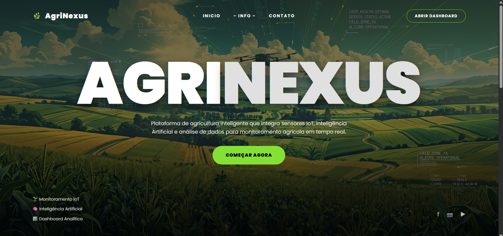
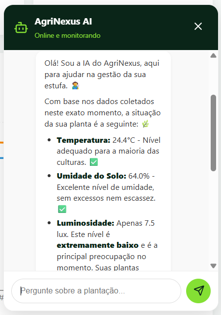
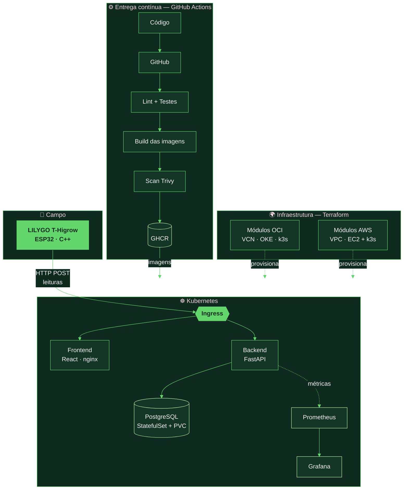

# 🌾 AgriNexus
<div align="center">

</div> 

> 📌 **Este README descreve o projeto como foi apresentado no TCC.**
> Depois da apresentação, a aplicação foi evoluída com uma camada de infraestrutura
> (Docker, Kubernetes, Terraform, CI/CD e multicloud) — documentada em
> **[Evolução pós-TCC: arquitetura DevOps/Cloud](#-evolução-pós-tcc-arquitetura-devopscloud)**.

## 📘 Visão Geral

O **AgriNexus** é uma plataforma completa de **agricultura de precisão e gestão IoT** desenvolvida como projeto de TCC.  
A plataforma integra hardware (sensores IoT como LILYGO T-Higrow) e software para **coletar, armazenar e analisar em tempo real** métricas climáticas e de solo (umidade, temperatura, luz, tensão de bateria), auxiliando os agricultores na tomada de decisão.

Além do monitoramento em tempo real, o sistema conta com recursos de **Inteligência Artificial (Google Gemini)** para análises preditivas, um **Chatbot Agrônomo** interativo, proteção avançada por **Tokens JWT** (OAuth2), e módulos de **Gestão Financeira** e de **Agendamentos**.

---

## 🖥️ Interface

<div align="center">

<br/><em>Página inicial</em>
</div>

<br/>

<div align="center">

<br/><em>Chatbot Agrônomo interpretando as leituras dos sensores em tempo real</em>
</div>

---

## 🧩 Tecnologias Utilizadas

| Categoria | Tecnologia | Descrição |
|-----------|-------------|-----------|
| **Frontend** | [React.js](https://react.dev/) + Vite | Interface Single Page Application (SPA), estilização com CSS puro e gráficos com Recharts. |
| **Backend** | [FastAPI](https://fastapi.tiangolo.com/) (Python) | API REST escalável e de alta performance, responsável por gerenciar a lógica de negócios. |
| **Banco de Dados** | [PostgreSQL](https://www.postgresql.org/) | Armazenamento relacional estruturado utilizando o ORM **SQLAlchemy**. |
| **Inteligência Artificial** | Google Gemini (2.5-flash) | Processamento de linguagem natural para geração de insights em tempo real e Chatbot. |
| **Segurança** | JWT & bcrypt | Fluxo de autenticação OAuth2 com emissão de Tokens e criptografia avançada de senhas. |
| **Hardware IoT** | C++ / ESP32 (Arduino IDE) | Placa LILYGO T-Higrow programada em C++ pela Arduino IDE, com sensores calibrados de umidade de solo e ambiente, que se comunicam com a API via requisições HTTP POST autenticadas. |
| **Deploy / Nuvem** | Railway / Render | Hospedagem da aplicação e do banco de dados na nuvem para acesso global. |

---

## 📁 Estrutura do Projeto

O repositório está dividido em dois blocos principais:

*   **/backend:** Contém toda a lógica do servidor em Python (FastAPI), modelos do banco de dados (SQLAlchemy), esquemas de validação (Pydantic), integração com a IA (Google GenAI) e rotas de segurança (JWT).
*   **/frontend:** Contém a aplicação web construída em React.js (Vite), incluindo páginas do painel de controle, gráficos interativos, chatbot e componentes visuais.

---

## 🔌 Integração com o Hardware

A placa **LILYGO T-Higrow** (ESP32) foi programada em **C++ pela Arduino IDE** e teve seus
sensores **calibrados** antes da coleta — etapa necessária porque o sensor capacitivo de
umidade de solo entrega leituras brutas que variam conforme o solo e a alimentação, e sem
calibração os valores não correspondem à umidade real.

A cada ciclo, a placa envia as leituras para a API:

```http
POST /api/leituras
x-api-key: <chave do dispositivo>

{
  "sensor_id": "placa-01",
  "umidade_solo": 64.0,
  "temperatura": 24.4,
  "umidade_ar": 55.0,
  "luz": 7.5,
  "bateria": 3.9,
  "rssi": -62,
  "firmware": "1.0.0"
}
```

A autenticação é feita por um cabeçalho `x-api-key`, cujo valor precisa ser **o mesmo**
gravado no firmware da placa e configurado na variável de ambiente `IOT_API_KEY` da API.
Requisições sem a chave correta recebem `401`, impedindo que terceiros injetem leituras
falsas. Além da umidade e temperatura, a placa reporta luminosidade, salinidade, tensão de
bateria e intensidade do sinal Wi-Fi (RSSI), o que permite monitorar também a saúde do
próprio dispositivo em campo.

---

## ✨ Funcionalidades Principais

1.  **Dashboard IoT em Tempo Real:** Visualização contínua dos dados enviados pelos sensores físicos (Umidade, Temperatura, Luz, Bateria).
2.  **Segurança Avançada (OAuth2):** Autenticação robusta utilizando JSON Web Tokens (JWT) e senhas criptografadas (bcrypt).
3.  **Agrônomo Virtual (IA):** Integração com o Google Gemini para analisar os dados instantâneos da estufa e fornecer recomendações agronômicas acionáveis.
4.  **Chatbot Interativo:** Um assistente virtual com contexto "injetado" que sabe exatamente como estão os sensores antes de responder às perguntas do produtor.
5.  **Módulo Financeiro:** Controle de faturas, pagamentos de assinaturas, cálculo de despesas em aberto e geração de recibos em PDF.

---

## 🔮 Trabalhos Futuros

Como propostas de melhoria contínua para futuras iterações deste projeto, sugere-se:
*   **Atuadores Automáticos:** Ligar a bomba de água da estufa de forma autônoma através da API quando a umidade do solo atingir níveis críticos.
*   **Versão Mobile:** Desenvolvimento de um aplicativo nativo (React Native ou Flutter) para os agricultores acompanharem as estufas no campo.
*   **Notificações Ativas:** Criação de alertas via WhatsApp/Telegram utilizando APIs de mensageria para faturas pendentes ou falha em sensores.

---

## 🎓 Autoria
*   **Desenvolvedora:** [Gabriela Reis]
*   **Orientador(a):** [Ricardo Fugencio]
*   **Instituição:** [Uniaraxá] - 2026

---
---

# 🚀 Evolução pós-TCC: arquitetura DevOps/Cloud

> Tudo acima descreve o AgriNexus como entregue e apresentado no TCC, quando a aplicação
> rodava hospedada no Railway. Esta seção documenta o trabalho feito **depois** da
> apresentação: reempacotar a mesma aplicação, sem alterar suas funcionalidades, para
> rodar em Kubernetes com infraestrutura versionada e entrega automatizada.

## Por que esta evolução

O TCC entregou um produto funcional, mas com dependências que limitam sua evolução:
deploy manual acoplado a um provedor específico, credenciais no código, nenhum teste
automatizado e ambientes que não eram reproduzíveis. Esta etapa ataca exatamente isso,
aplicando práticas de engenharia de infraestrutura — e deixando registrados os trade-offs
reais encontrados pelo caminho, inclusive onde a solução "ideal" não foi viável.

## Arquitetura


```mermaid
%%{init: {'theme':'base','themeVariables':{
  'primaryColor':'#123526',
  'primaryTextColor':'#f4f7f5',
  'primaryBorderColor':'#63d66c',
  'lineColor':'#63d66c',
  'secondaryColor':'#0f2a1f',
  'tertiaryColor':'#0f2a1f',
  'clusterBkg':'#0f2a1f',
  'clusterBorder':'#63d66c',
  'fontFamily':'Segoe UI, Roboto, sans-serif'
}}}%%
flowchart TB
    subgraph campo["🌱 Campo"]
        S["LILYGO T-Higrow<br/>ESP32 · C++"]
    end

    subgraph entrega["⚙️ Entrega contínua — GitHub Actions"]
        A["Código"] --> B["GitHub"]
        B --> C["Lint + Testes"]
        C --> D["Build das imagens"]
        D --> E["Scan Trivy"]
        E --> F[("GHCR")]
    end

    subgraph cluster["☸️ Kubernetes"]
        G{{"Ingress"}}
        G --> H["Frontend<br/>React · nginx"]
        G --> I["Backend<br/>FastAPI"]
        I --> J[("PostgreSQL<br/>StatefulSet + PVC")]
        I -.->|"métricas"| M["Prometheus"]
        M --> N["Grafana"]
    end

    subgraph nuvem["🌍 Infraestrutura — Terraform"]
        O["Módulos OCI<br/>VCN · OKE · k3s"]
        P["Módulos AWS<br/>VPC · EC2 + k3s"]
    end

    S -->|"HTTP POST<br/>leituras"| G
    F -->|"imagens"| cluster
    O -.->|"provisiona"| cluster
    P -.->|"provisiona"| cluster

    classDef destaque fill:#63d66c,stroke:#0f2a1f,color:#0f2a1f,font-weight:bold
    classDef dados fill:#123526,stroke:#bff3a7,color:#f4f7f5
    class S,G destaque
    class J,F,M,N dados
```

Os manifests do Kubernetes são os mesmos em todos os ambientes: um **base** comum e
**overlays** do Kustomize que ajustam apenas o que muda por ambiente (réplicas, classe
de armazenamento, controlador de Ingress e domínios).

## Tecnologias adicionadas

| Camada | Tecnologia | Papel |
|---|---|---|
| Containers | Docker, Docker Compose | Empacotamento e execução local |
| Orquestração | Kubernetes, Kustomize, kind | Execução em cluster e variação por ambiente |
| IaC | Terraform | Provisionamento de rede e cluster em nuvem |
| CI/CD | GitHub Actions, GHCR | Validação, build, publicação e deploy |
| Testes | pytest | Testes de fumaça da API |
| Segurança | Trivy, ruff | Varredura de vulnerabilidades e lint |

## Como executar

### 1. Docker Compose (mais simples)

```bash
cp .env.example .env     # preencha as variáveis
docker compose up --build
```
Frontend em `http://localhost:3000`, API em `http://localhost:8000/docs`.

### 2. Kubernetes local (kind)

```bash
kind create cluster --config k8s/kind-cluster.yaml

kubectl apply -f https://raw.githubusercontent.com/kubernetes/ingress-nginx/controller-v1.11.3/deploy/static/provider/kind/deploy.yaml
kubectl wait --namespace ingress-nginx --for=condition=ready pod \
  --selector=app.kubernetes.io/component=controller --timeout=180s

docker build -t agrinexus-backend:latest ./backend
docker build --build-arg REACT_APP_API_URL=http://api.127.0.0.1.nip.io \
  -t agrinexus-frontend:latest ./frontend
kind load docker-image agrinexus-backend:latest agrinexus-frontend:latest --name agrinexus

cp k8s/base/secret.env.example k8s/base/secret.env   # preencha os valores
kubectl apply -k k8s/overlays/local
```

Acesse `http://app.127.0.0.1.nip.io`. Os domínios usam **nip.io**, que resolve qualquer
`*.127.0.0.1.nip.io` para localhost — assim não é preciso editar o arquivo `hosts`.

### 3. Nuvem (Terraform)

```bash
cd terraform/environments/oci          # ou .../aws
cp terraform.tfvars.example terraform.tfvars
terraform init
terraform plan
```

O `apply` é intencionalmente um passo manual; veja os custos em
[Decisões de arquitetura](#decisões-de-arquitetura).

## Docker

As imagens seguem práticas de segurança e confiabilidade:

- **Multi-stage build** no frontend: compila com Node e serve o resultado estático com nginx
- **Usuário não-root** no backend (`appuser`, UID 1000)
- **Healthcheck** em ambas, apontando para `127.0.0.1` (e não `localhost`, que resolve para
  IPv6 dentro do container enquanto o nginx escuta apenas em IPv4)
- **`.dockerignore`** impedindo que `.env`, `.git` e `node_modules` entrem na imagem
- **Patches de segurança** aplicados na build (`apt-get upgrade` / `apk upgrade`)

## Kubernetes

```
k8s/
├── base/                 # manifests comuns a todos os ambientes
└── overlays/
    ├── local/            # kind: 1 réplica, nginx, nip.io
    ├── oci/              # k3s: local-path, traefik, recursos reduzidos
    └── aws/              # gp2, hosts próprios
```

Recursos utilizados: `Namespace`, `Deployment`, `Service`, `ConfigMap`, `Secret`,
`Ingress`, `StatefulSet` com `PersistentVolumeClaim`, probes de *liveness* e *readiness*,
limites de CPU/memória e `securityContext` endurecido.

Dois detalhes de projeto que valem nota:

- **Ingress roteia por host, não por path.** Frontend e backend compartilham caminhos
  (`/login` existe nos dois), então `app.*` e `api.*` evitam a colisão.
- **Nenhum segredo nos manifests.** O `Secret` é gerado pelo `secretGenerator` do Kustomize
  a partir de um `secret.env` que nunca é versionado.

## Terraform

```
terraform/
├── modules/
│   ├── oci-network/   oci-oke/   oci-k3s/
│   └── aws-network/   aws-k3s/
└── environments/
    ├── oci/
    └── aws/
```

Os módulos resolvem dinamicamente o que varia por região e muda com o tempo — versão do
Kubernetes, OCID de imagem e AMI — em vez de fixar identificadores que quebrariam em outra
região ou no futuro.

## CI/CD

**`ci.yml`** — a cada push e pull request:

| Job | O que faz |
|---|---|
| `backend` | lint (ruff) e 6 testes com **PostgreSQL real** via service container |
| `frontend` | `npm ci` e build |
| `kubernetes` | `kustomize build` nos 3 overlays |
| `terraform` | `fmt -check` e `validate` nos 2 ambientes |
| `imagens` | build das imagens e varredura Trivy |

**`cd.yml`** — publica as imagens no **GHCR** (autenticado pelo `GITHUB_TOKEN`, sem secret
adicional) e faz deploy no Kubernetes sob acionamento manual.

Duas decisões deliberadas: o lint roda apenas com as regras de defeito real
(`E9,F63,F7,F82`), porque o conjunto completo acusaria 82 questões de estilo e tornaria o
job ruído; e o Trivy falha somente em **CRITICAL com correção disponível**, já que as
imagens base carregam dezenas de HIGH sem patch upstream, que bloqueariam o pipeline sem
nenhuma ação possível.

## Observabilidade

A API é instrumentada com `prometheus-fastapi-instrumentator` e expõe `/metrics` com
métricas de negócio da própria aplicação — contagem de requisições, latência por rota e
códigos de status — em vez de apenas métricas genéricas de infraestrutura.

```bash
cp k8s/observability/secret.env.example k8s/observability/secret.env
kubectl apply -k k8s/observability
```

Grafana em `http://grafana.127.0.0.1.nip.io` e Prometheus em
`http://prometheus.127.0.0.1.nip.io`.

| Componente | Função |
|---|---|
| Prometheus | Descobre os pods automaticamente via anotações `prometheus.io/*` e coleta a cada 15s |
| Grafana | Datasource e dashboard provisionados por código, sem configuração manual |

O dashboard **AgriNexus — API** traz taxa de requisições, latência p95, taxa de erro 5xx,
pods ativos e séries temporais por rota e por código de status.

Duas decisões conscientes para o contexto de laboratório: o Prometheus usa `emptyDir` com
retenção de 6h, em vez de volume persistente — reiniciar o pod descarta o histórico, o que
é aceitável aqui e evita consumir armazenamento; e a senha do Grafana vem de um `Secret`
gerado a partir de um arquivo que nunca é versionado.

Vale registrar que este stack consome cerca de 400MB de RAM, o que **não caberia** no nó
Always Free da OCI (1GB) — mais um ponto em que a restrição de recursos gratuitos moldou a
arquitetura.

## Segurança

- Segredos **apenas** por variável de ambiente, com falha explícita na inicialização
  quando ausentes — nada de valores padrão embutidos no código
- CORS configurável por ambiente (era fixo em `*`)
- Dependências com versão fixada, após um incidente real: o SQLAlchemy 2.1 trocou o driver
  padrão de `psycopg2` para `psycopg` v3 e quebrou o backend sem nenhuma alteração no código
- Containers sem privilégio: `runAsNonRoot`, `allowPrivilegeEscalation: false`,
  todas as *capabilities* removidas e `seccompProfile: RuntimeDefault`
- Credenciais de nuvem fora do repositório (`.tfvars`, `.tfstate` e `secret.env` ignorados)
- Varredura de imagens no pipeline

## Decisões de arquitetura

Nem toda escolha "ideal" se mostrou viável. O que foi encontrado e como foi resolvido:

**OKE com nós Ampere A1 → bloqueado por capacidade.** O control plane do OKE é gratuito,
mas o único shape de nó elegível ao Always Free é o Ampere A1, indisponível por falta de
capacidade em `sa-saopaulo-1` — e a *home region* não pode ser alterada após a criação da
conta. Consultando a API da OCI, confirma-se que os demais shapes aceitos pelo OKE são
todos pagos. O cluster e a rede seguem provisionados via Terraform, prontos para quando
houver capacidade.

**EKS → substituído por k3s em EC2.** O control plane do EKS custa cerca de US$ 73/mês,
sem equivalente no Free Tier. Como o objetivo é demonstrar Kubernetes e IaC, o módulo
provisiona um cluster k3s em uma instância EC2 — mesmo resultado prático, custo
drasticamente menor.

**AWS validada via `terraform plan`, sem `apply`.** Com o Free Tier da conta já expirado,
a infraestrutura é validada contra a API real da AWS sem criar recurso algum. O usuário IAM
tem apenas `AmazonEC2ReadOnlyAccess`, o que torna tecnicamente impossível gerar cobrança
com essas credenciais.

**Demonstração em cluster local.** Diante dos dois bloqueios acima, o ambiente de
demonstração é um cluster kind — gratuito, reproduzível e com os mesmos manifests usados
nos overlays de nuvem.

## Estrutura de diretórios

```
.
├── backend/            # FastAPI + testes
├── frontend/           # React
├── k8s/                # manifests Kubernetes (Kustomize)
│   └── observability/  # Prometheus + Grafana
├── terraform/          # infraestrutura como código
├── .github/workflows/  # pipelines de CI/CD
└── docker-compose.yml
```